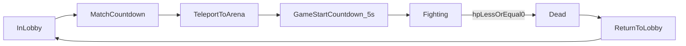

# BlindFire Demo 实施方案（流程对齐版）

## 1. 本版目标

- 对齐最新玩法流程：大厅等待 -> 倒计时 -> 统一传送 -> 5 秒开局倒计时 -> 对战 -> 死亡回大厅。
- 保持“客户端本地预测 + 服务端仲裁关键事件”的同步策略。
- 使用当前 Studio 手工 Part 场景与简化模型快速完成可玩闭环。

---

## 2. 游戏流程（状态机）

### 2.1 详细流程
- `InLobby`：玩家出生在同一出生区，不参与战斗逻辑。
- `MatchCountdown`：按在场玩家启动倒计时（如 10 秒，可配置）。
- `TeleportToArena`：倒计时结束，把在场玩家传送至游戏区域，随机均匀分布。
- `GameStartCountdown_5s`：二次倒计时 5 秒，期间可锁输入或仅允许观察。
- `Fighting`：开始运动、射击、受击、血量结算。
- `Dead`：玩家命中次数达到 3 次后死亡，退出当前对局。
- `ReturnToLobby`：传回出生区，等待下一轮。

---

## 3. 核心玩法规则

### 3.1 玩家与载具关系
- 玩家坐在底部圆盘载具（Model：Part + Seat）上进行战斗。
- 载具包含炮管 Part，炮管内包含开火用 `Attachment`（炮弹出生点）。
- 玩家在战斗期间始终水平面朝“射击方向”（与视角水平朝向一致）。
- 炮管朝向与玩家水平朝向同步旋转。

### 3.2 运动与边界
- 开局随机一个朝向，做匀速直线运动。
- 在方形场地内碰到四面墙发生反弹（X/Z 分量反向）。
- 撞墙时除方向反射外，额外施加一个“反弹力脉冲”（沿墙法线反向弹开），避免贴墙滑行与卡边。
- 速度可保持恒定，首版不引入摩擦衰减（可后续再加）。

### 3.3 开火与力反馈
- 开火间隔固定为 `3s`。
- 每次开火：
  - 从炮管 `Attachment` 位置生成炮弹。
  - 给玩家一个与炮弹方向相反的反作用力（后坐）。
  - 给玩家一个旋转方向力（顺时针/逆时针，本次可随机或按当前状态翻转）。
- 当“开火旋转力”尚未结束时，玩家视角输入带来的主动旋转应减弱（加权降低）。

### 3.4 受击与死亡
- 玩家被命中时：
  - 施加命中方向的冲量（击退）。
  - 施加一个随机旋转力。
  - 扣减 1 层生命（总生命 3 层）。
- 命中 3 次后死亡，立即回出生区并退出本局战斗状态。

---

## 4. 网络与同步策略

## 4.1 总原则
- 客户端负责本机角色的平滑物理预测（移动、旋转、后坐感）。
- 服务端负责权威事件：开火合法性、命中结算、血量/死亡、回大厅传送。
- 其他客户端主要看 Roblox 复制结果与服务端广播事件。

### 4.2 服务端必须仲裁的事件
- 开火请求（CD 校验 `3s`、状态校验）。
- 炮弹生命周期与命中判定（命中谁、造成何种击退与旋转）。
- 撞墙反弹事件（用于可选校验与纠偏，防止客户端在墙边出现分歧）。
- 生命值变化与死亡判定。
- 回合状态切换（传送、开始、结束）。

### 4.3 客户端可本地预测的内容
- 本机移动积分与反弹视觉。
- 本机开火立即反馈（动画/后坐先行），最终以服务端回执纠偏。
- 本机视角驱动的水平朝向与炮管同步。

---

## 5. 模块与文件计划

### 5.1 共享层
- `Shared/GameConfig.luau`（MODIFY）
  - 新增：`LOBBY_COUNTDOWN`、`GAME_START_COUNTDOWN=5`、`FIRE_COOLDOWN=3`、`MAX_HITS=3`、场地参数、力参数。
- `Shared/NetMsg.luau`（MODIFY）
  - 统一封装回合、开火、命中、死亡、传送等事件。

### 5.2 服务端
-### 移除未调用的管理器

#### [DELETE] [BulletManager.luau](file:///c:/Users/herong/Desktop/work/BlindFire/Scripts/ServerStorage/Scripts/BulletManager.luau)
- 服务端旧的弹丸模拟逻辑，已被当前的客户端权威命中判定 + 服务端校验逻辑取代。

---

### 明确保留的管理器（用户要求保留）

#### [KEEP] [MarketplaceManager.legacy.luau](file:///c:/Users/herong/Desktop/work/BlindFire/Scripts/ServerScriptService/ServerGameManager/MarketplaceManager.legacy.luau)
#### [KEEP] [PlayerChatCommandManager.legacy.luau](file:///c:/Users/herong/Desktop/work/BlindFire/Scripts/ServerScriptService/ServerGameManager/PlayerChatCommandManager.legacy.luau)
#### [KEEP] [PlayerSettingManager.legacy.luau](file:///c:/Users/herong/Desktop/work/BlindFire/Scripts/ServerScriptService/ServerGameManager/PlayerSettingManager.legacy.luau)
- 虽然目前未被主体逻辑 `require`，但用户要求保留以备后续功能扩展（如商城、指令、设置）。

---
### 5.3 客户端
- `ReplicatedStorage/Scripts/Client/BulletClientManager.luau`（MODIFY）
  - 本地运动预测、反弹、朝向控制、开火本地反馈。
- `ReplicatedStorage/Scripts/Client/PlayerAimController.luau`（NEW）
  - 读取相机水平朝向并驱动玩家+炮管朝向。
- `Client/UIManager/GameFrame.local.luau`（MODIFY）
  - 开火按钮 + 冷却显示 + 血量显示（3 格/3 层）。

---

## 6. Studio 端方案（简化可落地）

### 6.1 Studio 实例创建方式（改为 MCP 自动创建）
- 不再以“手动搭建”为主流程，改为由 `Roblox_Studio MCP` 统一创建/校验实例树。
- Agent 执行时通过 MCP 按固定层级创建：
  - `Workspace/Arena/Floor`
  - `Workspace/Arena/Wall_N`
  - `Workspace/Arena/Wall_S`
  - `Workspace/Arena/Wall_E`
  - `Workspace/Arena/Wall_W`
  - `Workspace/LobbySpawnArea`
  - `Workspace/ArenaSpawnPoints`（可选）
  - `ReplicatedStorage/VehicleModel/BaseDisk`
  - `ReplicatedStorage/VehicleModel/Seat`
  - `ReplicatedStorage/VehicleModel/TurretBarrel`
  - `ReplicatedStorage/VehicleModel/MuzzleAttachment`
  - `ReplicatedStorage/ProjectileModel`
  - `ReplicatedStorage/RemoteEvents/*`

### 6.2 MCP 执行约束（Agent 计划要求）
- 创建前先查询实例是否存在；存在则复用，不重复创建。
- 每次 MCP 写入后立即回读校验关键属性（Parent、Name、ClassName、Position/Size）。
- 若创建失败，允许重试一次；仍失败则记录阻塞点并停止后续依赖步骤。

### 6.3 RemoteEvents（由 MCP 创建）
- `ReplicatedStorage/RemoteEvents/RequestFire`
- `ReplicatedStorage/RemoteEvents/NotifyFireAccepted`
- `ReplicatedStorage/RemoteEvents/NotifyHit`
- `ReplicatedStorage/RemoteEvents/NotifyHpChanged`
- `ReplicatedStorage/RemoteEvents/NotifyDead`
- `ReplicatedStorage/RemoteEvents/NotifyMatchState`
- `ReplicatedStorage/RemoteEvents/NotifyRoundOutcome`
- `ReplicatedStorage/RemoteEvents/NotifyTeleport`

---

## 7. 关键参数建议（首版）

- `FIRE_COOLDOWN = 3.0`
- `MAX_HITS = 3`
- `GAME_START_COUNTDOWN = 5`
- `MOVE_SPEED = 28~36`（建议先 32）
- `RECOIL_IMPULSE = 60~120`（按载具质量调）
- `HIT_IMPULSE = 80~140`
- `WALL_BOUNCE_IMPULSE = 70~130`（撞墙反弹力）
- `SPIN_FORCE_FIRE = 中等`
- `SPIN_FORCE_HIT = 随机区间`
- `AIM_ROTATION_SCALE_WHILE_SPIN = 0.3~0.6`

---

## 8. 验收标准（DoD）

- 流程层：
  - 玩家可从大厅进入一局完整对战并在死亡后返回大厅。
  - 5 秒开局倒计时稳定显示并生效。
- 战斗层：
  - 开火严格 3 秒 CD。
  - 开火有炮弹、后坐、旋转反馈。
  - 命中后有击退和随机旋转。
  - 撞墙时有明确反弹力反馈，不出现长期贴墙滑行。
  - 命中 3 次后死亡并退出战斗。
- 表现层：
  - 玩家与炮管朝向可随视角水平变化同步。
  - 多人下移动与命中观感一致，无明显错判。

---

## 9. 实施里程碑

- M1（0.5 天）：通过 `Roblox_Studio MCP` 创建并校验场景/模型/RemoteEvents 基础资产。
- M2（1 天）：完成 `MatchManager`（大厅、倒计时、传送、开战、回大厅）。
- M3（1.5 天）：完成 `CombatManager`（开火、炮弹、命中、hp、死亡、撞墙反弹力参数接入）。
- M4（1 天）：完成客户端朝向控制、后坐反馈、UI（冷却+血量）。
- M5（0.5 天）：联机联调、参数收敛、验收回归。

---

## 10. Agent 执行计划（可直接按此实施）

1. 资产层（Studio MCP）
- 用 `Roblox_Studio MCP` 建立 Arena、Lobby、Vehicle、Projectile、RemoteEvents 全部实例。
- 对每个关键实例做存在性与属性校验，生成“已创建清单”。

2. 回合层（服务端）
- 先实现 `MatchManager` 状态机与传送逻辑，保证“进场->开战->死亡回大厅”闭环。

3. 战斗层（服务端权威）
- 完成开火 3 秒 CD、炮弹生成、命中计数、死亡结算。
- 增加撞墙反弹力计算与服务端校验事件（用于纠偏）。

4. 手感层（客户端预测）
- 本地预测移动、后坐、旋转、撞墙反馈，收到服务端事件后做最小纠偏。
- 实现“旋转未结束时视角旋转输入减弱”。

5. UI 与验收
- 增加开火 CD、3 段血条 UI。
- 按 DoD 做单人 + 多人回归，并调优 `RECOIL/HIT/WALL_BOUNCE` 参数。
