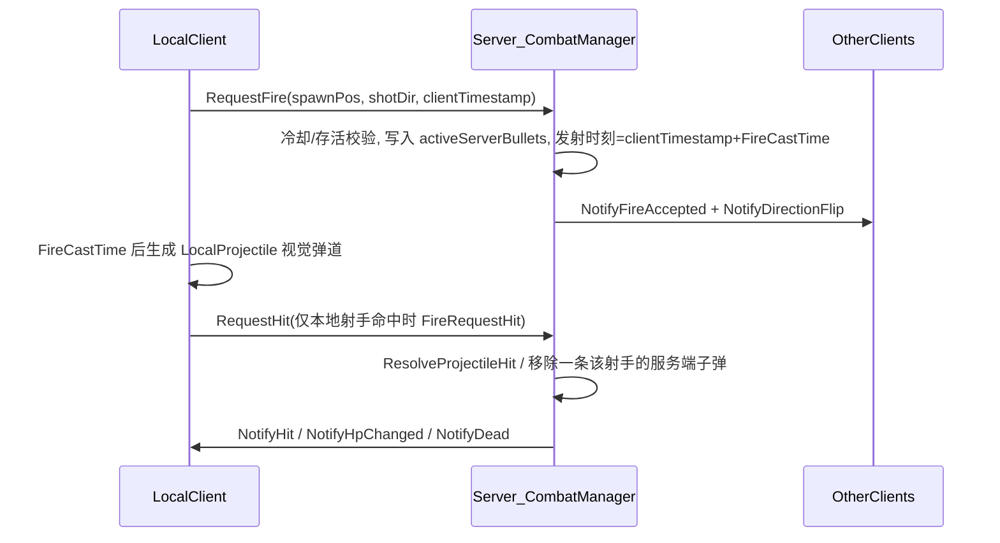

# 当前射击机制总结

## 架构概览



## 客户端（[`BulletClientManager.luau`](c:\Users\herong\Desktop\work\BlindFire\Scripts\ReplicatedStorage\Scripts\Client\BulletClientManager.luau)）

- **开火入口** `FireShot`：仅在 `matchState == "Fighting"` 时可用；用 `tick()` 做**本地** `FireCooldown` 预检（与 [`GameConfig.FireCooldown`](c:\Users\herong\Desktop\work\BlindFire\Scripts\ReplicatedStorage\Scripts\Shared\GameConfig.luau) 对齐）。
- **枪口与朝向**：优先 `TurretBarrel/MuzzleAttachment`，否则用底盘 CFrame 近似；从底盘上方一点向枪口做射线，若穿过 `ArenaFloor` 等则把生成点往回缩，减少穿地生成。
- **本地表现**：后坐力改 `AssemblyLinearVelocity` 与目标速度；`FireRequestFire` 携带 `workspace:GetServerTimeNow()`；在 **`FireCastTime` 延迟后**再生成名为 `LocalProjectile` 的假子弹模型。
- **假子弹运动**：每帧 `ProjectileSpeed`、水平 `Spherecast`、可反弹 `ProjectileMaxBounces`、与 [`GameConfig`](c:\Users\herong\Desktop\work\BlindFire\Scripts\ReplicatedStorage\Scripts\Shared\GameConfig.luau) 一致的**磁力修正**（半径 `BulletMagnetismRadius`、锥角 `BulletMagnetismAngleRad`）。
- **命中申报**：**仅当 `ownerId == localPlayerId` 且球体撞到玩家**时调用 `FireRequestHit`；其他客户端看到的他人假子弹会**穿过玩家模型**（注释写明为避免假视觉命中），爆炸以服务端 `NotifyHit` 为准。
- **他人开火**：`OnFireAccepted` 用 `serverTime` 与 `expectedLaunchTime` 做**插值/延迟生成**，减轻观测端不同步。

## 服务端（[`CombatManager.luau`](c:\Users\herong\Desktop\work\BlindFire\Scripts\ServerStorage\Scripts\CombatManager.luau)）

- **RequestFire**：方向压平为水平；`PlayerStateManager.CanFire`（`os.clock()` + `FireCooldown` + 存活）；翻转该单位 `spinDir`；子弹 **`activeTime = clientTimestamp + FireCastTime`** 后才参与模拟（与客户端前摇对齐）。
- **权威弹道**：`Heartbeat` 中 `Spherecast` 推进，寿命 `ProjectileLifetime`；磁力逻辑与客户端注释为一致；命中载具 `Vehicle_*` 或角色则 `ResolveProjectileHit`。
- **ResolveProjectileHit**：无敌窗口 `InvincibilityDuration`、受击随机 `spinDir`、扣血、广播 `NotifyHit` / `NotifyHpChanged` / `NotifyDead`；可配置 `CanHitSelf`。
- **RequestHit（关键）**：注释为 **“偏向射手：若其申报命中则采信”**，并**从 `activeServerBullets` 中移除该射手的一条子弹**（防止继续弹跳造成幽灵命中），然后同样走 `ResolveProjectileHit`。

## 配置要点（[`GameConfig.luau`](c:\Users\herong\Desktop\work\BlindFire\Scripts\ReplicatedStorage\Scripts\Shared\GameConfig.luau)）

- 弹速 `ProjectileSpeed`、前摇 `FireCastTime`、冷却 `FireCooldown`、反弹 `ProjectileMaxBounces`、`CanHitSelf`、磁力参数、无敌时长等均集中在此模块。

---

## 优化建议（按优先级）

### 1. 公平性与作弊面（高）

- **`RequestHit` 完全信任客户端**是当前最大风险：可伪造目标 ID、方向或连发申报。优化方向包括：仅信任服务端 `Spherecast` 结果并**删除或极度限制** `RequestHit`；若保留客户端申报，至少校验：射击者与目标距离、射线/球体是否与权威弹道一致、时间窗口内是否确有活跃子弹等。
- **`RequestFire` 未校验 `spawnPos`**：应与该玩家载具 `MuzzleAttachment`（或服务端记录的枪口）距离阈值内，防止墙内/远处生成。
- **客户端时间**：`activeTime` 使用 `clientTimestamp`；恶意或极大时钟偏差会影响服务端子弹启用时刻。可改为以**服务端收到时刻**为基准做有界修正，或钳制 `clientTimestamp` 与 `GetServerTimeNow()` 的差值。

### 2. 逻辑一致性与双路径伤害（中高）

- 同时存在「服务端弹道命中」与「客户端申报命中」两条路径，需保证**不会双重结算**；当前通过 `RequestHit` 时删一条服务端子弹缓解，但若同一帧两端都触发仍须审计。建议明确**唯一权威路径**或统一 idempotency（例如每发子弹唯一 ID，命中消费一次）。
- **`OnRequestHit` 删除子弹**为「该射手任意一条」，若未来允许多发同时存在（更短冷却或技能），可能误删错误子弹；可改为按**子弹实例 ID** 匹配。

### 3. 数值与几何一致性（中）

- 服务端 `GetProjectileRadius()` 固定 **1.25 倍**球体用于补偿延迟，而注释写默认 1.5；客户端从 `ProjectileModel/Core` 读取半径。建议**单一数据源**（例如 `GameConfig` 只读字段或服务端与客户端共用常量），避免手感与判定漂移。
- 客户端冷却用 `tick()`，服务端用 `os.clock()`：通常接近，但极端情况下可统一为**服务端回传「下次可开火时间」**或客户端也以服务器时间为准显示冷却。

### 4. 性能（中低，视规模）

- 每帧每颗子弹对**所有单位**做磁力距离与角度判断，复杂度约 O(子弹数 × 玩家数)。玩家人数上升时可做简单**空间分桶**或限制磁力扫描半径内的候选集合。

### 5. 体验与观测（低）

- 非射手客户端子弹穿人 + 服务端 `NotifyHit` 销毁最近视觉弹：已缓解不同步；若仍偶发「先爆炸后穿模」，可对 `OnHit` 的最近弹选择加入**距离/时间**双重约束。

---

## 涉及的主要文件

| 角色 | 文件 |
|------|------|
| 客户端开火与假弹道 | [`BulletClientManager.luau`](c:\Users\herong\Desktop\work\BlindFire\Scripts\ReplicatedStorage\Scripts\Client\BulletClientManager.luau) |
| 服务端弹道与命中 | [`CombatManager.luau`](c:\Users\herong\Desktop\work\BlindFire\Scripts\ServerStorage\Scripts\CombatManager.luau) |
| Remote 封装 | [`NetMsg.luau`](c:\Users\herong\Desktop\work\BlindFire\Scripts\ReplicatedStorage\Scripts\Shared\NetMsg.luau) |
| 数值配置 | [`GameConfig.luau`](c:\Users\herong\Desktop\work\BlindFire\Scripts\ReplicatedStorage\Scripts\Shared\GameConfig.luau) |
| 服务端冷却/生命 | [`PlayerStateManager.luau`](c:\Users\herong\Desktop\work\BlindFire\Scripts\ServerStorage\Scripts\PlayerStateManager.luau) |

若你后续希望**落地改动**，建议先定目标：偏竞技公平（弱化/废除 `RequestHit`）还是偏手感（保留申报但加校验与子弹 ID）。

---

## 方案迭代：Trust but Verify + 距离容差（与上文第 1、2 条对齐）

下面在你提供的「字典 + 动态容差」思路上，补充与本项目（载具、现有双路径命中）一致的**实现建议**与**注意点**。

### 认同的核心方向

- **保留 `RequestHit`**：继续优先射击端手感（本地 Spherecast 先响）。
- **`activeServerBullets` 从数组改为字典**：以 **`bulletId` → 子弹状态** 存储，`currentPosition` / `shotDir` 与服务端 `OnHeartbeat` 同步更新，是**幂等结算**（避免双路径双扣血）的前提。
- **动态容差**：`允许距离 ≈ 判定半径相关项 + f(目标速度) + 基础宽容 Studs`，比单一常数更适应快跑目标与高延迟；`BaseHitTolerance` 初值 3～5 studs、靠线上日志调参是合理做法。
- **双路径闭环**：`Spherecast` 命中与 `RequestHit` 都应「先查 `bulletId` 是否仍存在 → 再 `ResolveProjectileHit` → 再删字典项」；若已不存在则说明另一条路径已结算，**跳过**。

### 建议修正或加强的细节

1. **子弹 ID 由谁生成（重要）**  
   仅客户端 `HttpService:GenerateGUID` 仍可被伪造或复用旧 ID。更稳妥做法：**在 `RequestFire` 受理时由服务端生成 `bulletId`**，通过已有的 `NotifyFireAccepted` **下发给所有客户端**；本地假弹道与 `RequestHit` 只带这个**服务端认可的 ID**。这样字典里天然「只存在服务端发过的键」，伪造 ID 无效。

2. **目标位置参考点（本项目不是 HumanoidRootPart）**  
   伪代码里的 `HumanoidRootPart` 应改为本玩法权威单位：**[`CombatManager`](c:\Users\herong\Desktop\work\BlindFire\Scripts\ServerStorage\Scripts\CombatManager.luau) 中 `unitInfo.rootPart`（`BaseDisk`）** 或从 `Vehicle_<UserId>` 解析出的 `PrimaryPart`。距离校验用**水平距离**（`XZ`）与弹道一致，可避免 Y 轴微小差异误伤判。

3. **容差公式可再含「射击端延迟」项**  
   仅用 `目标速度 × MaxPingCompensation` 偏护**移动目标**；高延迟射击者自己的误差还可加一项：例如用 **服务端记录的 `RequestFire` 接收时刻与 `clientTimestamp` 的差** 估计 RTT 上界，再乘以 `ProjectileSpeed` 得到额外 Studs 上限（或并入 `MaxPingCompensation` 的语义：取「目标移动项」与「射手延迟项」的较大者）。避免正当高 ping 玩家被大量误拒。

4. **与 `spawnPos` 校验配套**  
   距离容差解决「命中申报 vs 服务端弹位」；**枪口生成点**仍建议单独做 **RequestFire 时 spawn 与 `GetMuzzleAttachment` 的 MaxDistance**，否则外挂仍可从异常点发射，再在别处「合法距离」内申报命中。

5. **防刷包与多发并存**  
   在冷却之外，对 **每名玩家 `activeServerBullets` 中未销毁子弹数量设上限**（例如 1～2，与 `FireCooldown` 匹配），防止异常连发 `RequestHit`。

6. **拒绝命中时的客户端表现（可选）**  
   若增加 `NotifyHitRejected(bulletId, reason)`，本地可撤销爆炸特效或仅打日志；否则正当玩家偶发被拒时至少要有**服务端/分析日志**便于调 `BaseHitTolerance` 与补偿系数。

7. **网络与 Remote 变更**  
   `NetMsg` 中 `RequestHit` 需从 `(targetPlayerId, hitDir)` 扩展为 **`(bulletId, targetPlayerId, hitDir)`**（`clientHitPos` 可选：仅作辅助校验或反作弊日志，权威仍以服务端弹位为准）。`NotifyFireAccepted` 需增加 **`bulletId`** 参数。

### 小结

你提供的方案与当前代码缺口高度吻合：**字典 + bulletId 是幂等与防误删的基石；动态距离容差是保留 `RequestHit` 前提下抑制全图秒杀与极端错位的第一道防线**。落地时优先采用 **服务端签发 bulletId**，并把命中判定的几何锚点改为 **`BaseDisk` 水平距离**，与现有 `CombatManager` 数据结构一致。

---

## 动态容差详细方案（规格）

本节把「距离容差」写成可实现的**规格**：输入、几何定义、公式、配置项、校验顺序、边界情况与调参方法。

### 1. 目标与适用范围

- **目标**：在 `RequestHit(bulletId, targetPlayerId, …)` 到达时，用服务端权威状态判断「该申报是否在**物理上可接受**的误差范围内」，通过则进入 `ResolveProjectileHit`，否则拒绝并打日志（可选通知客户端）。
- **适用范围**：仅针对 **客户端申报命中** 路径；服务端 `Spherecast` 自洽命中可仍走原逻辑，但需与 **同一 `bulletId` 幂等**（见前文双路径闭环）。
- **不解决**：枪口伪造（需 spawn 校验）、无子弹刷包（需 bulletId + 冷却 + 并发上限）、自瞄修改内存（需更深层防护）。

### 2. 几何定义（与现有弹道一致）

- **弹丸参考点**：服务端该 `bulletId` 对应条目的 **`currentPos`**（与 `OnHeartbeat` 每步更新一致；申报到达时刻的快照）。
- **目标参考点**：目标玩家 `unitInfo.rootPart`（`BaseDisk`）的 **`Position`**。
- **距离定义**：**水平距离**（与 `CombatManager` 里 `ToHorizontalDirection`、弹道共面一致）：

\[
d = \left\| \mathrm{flat}(\mathbf{p}_{bullet}) - \mathrm{flat}(\mathbf{p}_{target}) \right\|
\]

其中 \(\mathrm{flat}(v) = (v_x,\,0,\,v_z)\)。避免 Y 轴漂移导致误拒。

- **可选加强**：若希望与「球体打到圆柱近似」一致，可把目标视作水平面上半径 \(R_{target}\) 的圆盘（例如 `BaseDisk.Size.X/2`），则判据改为：

\[
d \le R_{target} + R_{eff} + T_{dyn}
\]

下文 \(R_{eff}\)、\(T_{dyn}\) 为有效判定半径与动态容差。实现时可先简化为 **点 vs 点**（不把 \(R_{target}\) 并入），调参时若「擦边打不中」再打开。

### 3. 动态容差公式（建议）

定义 **允许的最大水平误差** \(D_{max}\)（单位：studs）：

\[
D_{max} = R_{eff} + T_{move} + T_{shooter} + B
\]

| 符号 | 含义 | 建议计算 |
|------|------|----------|
| \(R_{eff}\) | 有效弹体命中半径 | \(R_{proj} \cdot M_{sphere}\)，其中 \(R_{proj}\) 与客户端 `ProjectileModel/Core` / `GameConfig` 统一；\(M_{sphere}\) 为当前服务端 Spherecast 已用的放大（如 **1.25**），避免重复乘两次需在实现时二选一固定。 |
| \(T_{move}\) | 目标运动导致的同步误差 | \(v^{xz}_{target} \cdot \tau_{sync}\)，其中 \(v^{xz}_{target} = \|\mathrm{flat}(\mathbf{v}_{target})\|\)，\(\mathbf{v}_{target}\) 取 `rootPart.AssemblyLinearVelocity`；\(\tau_{sync}\) 为配置项 `HitValidationTargetSyncSeconds`（量级 **0.05～0.12**）。 |
| \(T_{shooter}\) | 射击端网络/时钟导致的弹位误差 | \(\min(\tau_{net},\,\tau_{cap}) \cdot v_{proj}\)，其中 \(v_{proj} =\) `GameConfig.ProjectileSpeed`；\(\tau_{net}\) 用服务端记录的 **RTT 估计**（见下节）；\(\tau_{cap}\) 为 `HitValidationShooterLatencyCapSeconds`（如 **0.25～0.35**），防止外挂故意拉大时间差刷大容差。 |
| \(B\) | 基础宽容度 | `HitValidationBaseStuds`，初值 **3～5**，吸收浮点、磁力与步进差异。 |

**合并写法（实现时一行近似）：**

```text
allowed = Reff + targetSpeedXZ * tauSync + min(estimatedRtt, tauCap) * ProjectileSpeed + baseStuds
if horizontalDist(bulletPos, targetPos) <= allowed then accept else reject
```

### 4. 射击端延迟 \(\tau_{net}\) 的估计（服务端可落地）

在 **`OnRequestFire`** 时记录：

- `serverReceiveTime = workspace:GetServerTimeNow()`（或 `os.clock()` 若你统一用相对时间，但建议与子弹 `activeTime` 同一时钟系）。
- 客户端传入 `clientTimestamp`（当前已是 `GetServerTimeNow()`）。

定义原始差：

\[
\Delta = serverReceiveTime - clientTimestamp
\]

- **钳制**：\(\Delta \in [\Delta_{min}, \Delta_{max}]\)（如 **[-0.2, 0.6]** 秒），超出则按边界计并可选记一条「时钟可疑」日志（不必然踢人）。
- **RTT 上界近似**：\(\tau_{net} = \mathrm{clamp}(\Delta,\,0,\,\tau_{cap})\) 或使用 **单向延迟保守估计** \(\tau_{net} = \min(\max(0,\Delta),\,\tau_{cap})\)。  
  若日后有真正的 `Ping` 统计，可替换为 `min(pingSeconds/2, tauCap)`。

说明：这是**启发式**，不是真实 RTT；目的是让高延迟射手的申报在「弹丸多飞了可解释的一段距离」内仍可通过。

### 5. 校验顺序（`OnRequestHit` 内建议流水线）

1. **玩家与回合状态**：射击者存活、参与回合、目标存活、`targetPlayerId` 合法。
2. **`bulletId` 存在且 `shooterId` 匹配**，且该子弹仍处于「可命中窗口」（未超时、未因反弹逻辑提前销毁）。
3. **自击规则**：与现有 `CanHitSelf`、反弹次数一致。
4. **几何容差**：按第 3 节计算 \(d\) 与 \(D_{max}\)；若不通过 → **拒绝**（带结构化日志：`d`, `D_max`, 各项分解）。
5. **通过**：从字典 **原子移除**该 `bulletId`（或标记 consumed），再 `ResolveProjectileHit`（与 Heartbeat 路径互斥）。

### 6. 建议写入 `GameConfig` 的字段（命名示例）

- `HitValidationBaseStuds`：基础 Studs，默认 **4**。
- `HitValidationTargetSyncSeconds`：\(\tau_{sync}\)，默认 **0.08**。
- `HitValidationShooterLatencyCapSeconds`：\(\tau_{cap}\)，默认 **0.30**。
- `HitValidationClientTimestampMinDelta` / `MaxDelta`：钳制 \(\Delta\)，默认 **-0.2 / 0.6**。
- （与半径统一后）`ProjectileHitRadiusStuds` 或沿用现有半径 + `ServerSpherecastMultiplier` **二选一**写清，避免 `1.25` 重复乘。

`VisibleParameters` 中可择要暴露，便于线上热更（若项目已有 `NotifyGameConfigSync` 流程）。

### 7. 边界与特殊情况

- **无敌**：仍在 `ResolveProjectileHit` 内处理；容差通过只表示「几何上允许」，不改变无敌免伤。
- **目标刚复活/传送**：若 `rootPart` 瞬移，`d` 可能很大 → 拒绝；若业务需要可单独放宽「传送后 N 秒内」规则（一般不必）。
- **多子弹**：必须依赖 **`bulletId`**，否则容差无法对应到正确 `currentPos`。
- **磁力**：客户端与服务端均有磁力，\(B\) 与 \(R_{eff}\) 需略宽裕；若拒绝率偏高，优先略增 `BaseStuds` 或 `tauSync`，而非无限放大 \(\tau_{cap}\)。

### 8. 调参与观测

- **指标**：`hit_validation_reject_rate`（按用户/按对局）、拒绝时 `d - D_max` 分布。
- **误拒多**：略增 `BaseStuds` 或 `tauSync`；检查是否 **半径双计 1.25**、是否误用三维距离。
- **外挂仍近身秒**：缩小 `BaseStuds`、检查 **spawn 校验**与 **每玩家子弹数上限**；容差只解决「离谱距离」。

### 9. 与客户端的契约

- 客户端 **仍只申报** `targetPlayerId` + `hitDir`（+ `bulletId`）；**不必**以 `clientHitPos` 作为权威；若上传仅用于日志对比。
- 若拒绝：可选 `NotifyHitRejected` 以便本地撤销爆炸；否则本地可能「已爆炸但无伤」，需接受或做弱同步。
